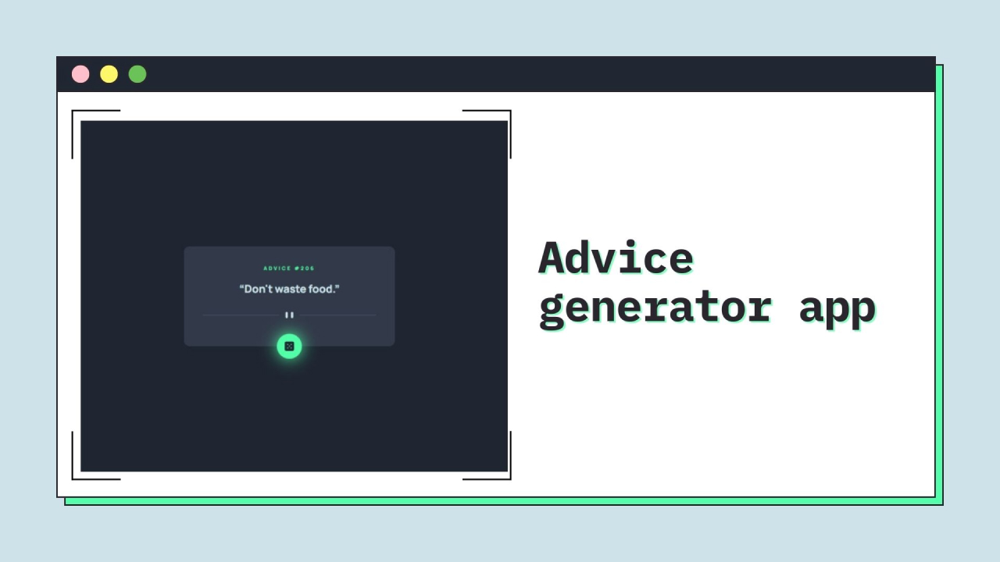

<h1 align="center">Advice generator app
</h1>

&nbsp;



<h2 align="center"> 
	🚧 Advice generator app 🟢 Completed 🚀 🚧
  
</h2>

&nbsp;

<!--
## Table of contents

- [Project description](#description) - [What I learned](#What-I-learned) -->

<h2 id="#description">Project description 📚</h2>

This is a solution to the challenge
[Advice generator app](https://www.frontendmentor.io/challenges/advice-generator-app-QdUG-13db).

This is a challenge on the Mentor frontend site, where I was able to put my knowledge of async/await into practice.

<a href="https://www.frontendmentor.io/challenges?difficulties=4"></a>

&nbsp;

## What I learned

I used async/awai, and fetch() to be able to generate advice through the adviceslip API and generated an error message if the promise is not resolved with cath()

API: https://api.adviceslip.com/advice

```js
try {
  const res = await fetch("https://api.adviceslip.com/advice");
  const data = await res.json();
  adviceText.innerText = `“${data.slip.advice}”`;
  adviceID.innerText = data.slip.id;
} catch (err) {
  console.error(new Error("It is not an internet connection"));
}
```

## Links

- [Preview Site](https://vinicius-advice-generator.netlify.app)
<!-- - [Frontend Mentor Solution Page](https://www.frontendmentor.io/solutions/challenge-completed-with-htmlcssleaflet-jsgrid-and-responsive--kw3kKedNp) -->

## My process

### Built with

- [HTML](https://developer.mozilla.org/en-US/docs/Web/HTML)
- [CSS](https://developer.mozilla.org/en-US/docs/Web/CSS)
- [JS](https://sass-lang.com)
- [API]()

## 👨‍💻 Author

- [Frontend Mentor](https://www.frontendmentor.io/profile/viniciusshenri96)
- [Linkedin](https://www.linkedin.com/in/vinícius-henrique-7a2533229/)
